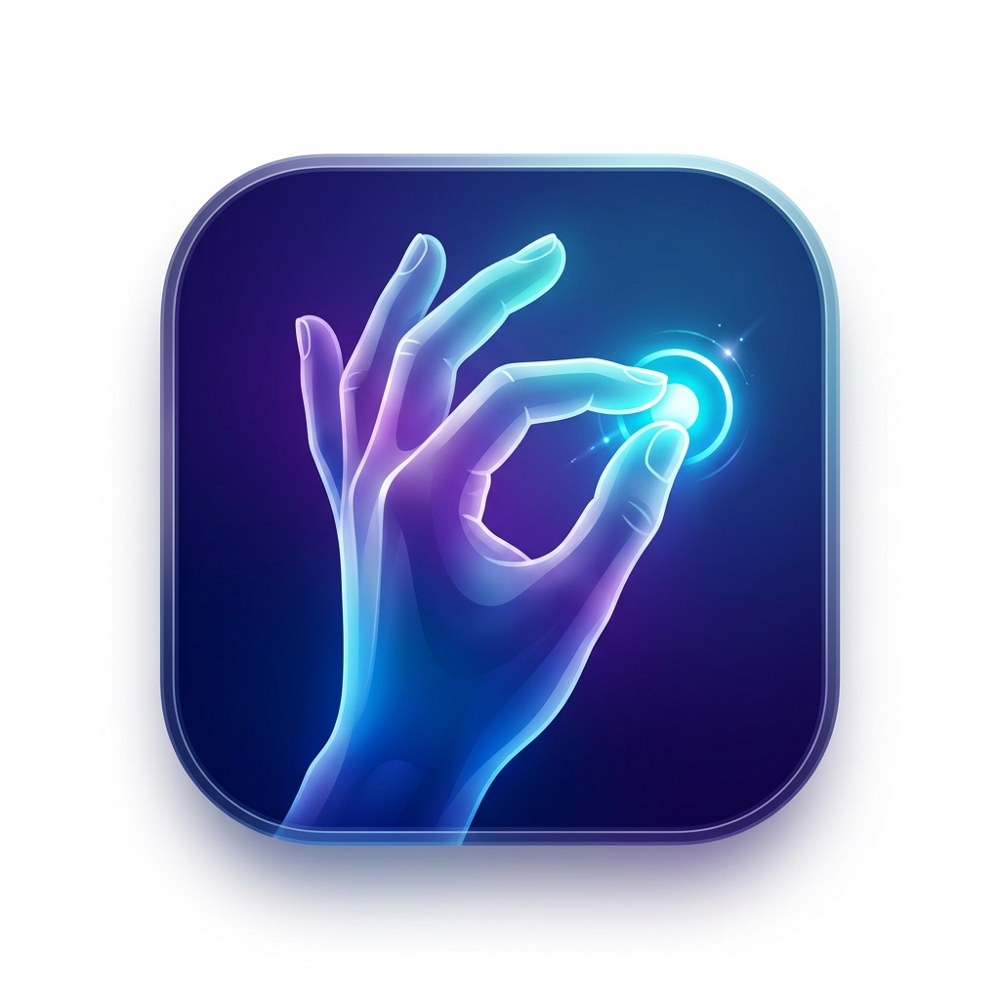

<p align="center">
  
</p>

<h1 align="center">HandCursor App 🖐️💻</h1>

<p align="center">
  <b>Controle o seu Mac usando apenas gestos das mãos, como se fosse magia.</b>
</p>

<p align="center">
  <a href="#-instalação"></a>
  
  
</p>

---

O **HandCursor App** é um aplicativo nativo para macOS que permite controlar o cursor do sistema utilizando visão computacional baseada em gestos da mão. Transforme o seu Mac num dispositivo futurista que responde perfeitamente aos seus movimentos, dispensando o mouse!

## ✨ Funcionalidades

- 🎯 **Controle de Cursor**: Aponte com o dedo indicador para mover o mouse rapidamente.
- 🐌 **Freio Gravitacional**: O cursor desacelera automaticamente à medida que os dedos se aproximam, permitindo uma mira perfeita a nível de pixel.
- 🤏 **Clique Mágico**: Junte a ponta do polegar com o indicador (formato de "C") para dar cliques normais ou segurar e arrastar.
- 🧠 **Visão Computacional Nativa**: Processamento veloz e eficiente usando o _Vision Framework_ da Apple, sem consumir muita bateria.
- 🚀 **Interface Moderna**: Uma interface SwiftUI limpa e profissional com onboarding interativo.

## 📥 Instalação

Para usar o aplicativo imediatamente sem precisar compilar o código:

1. Acesse a aba [Releases](https://github.com/gleissondouglas/handcursor/releases) (Lançamentos) ao lado direito da página.
2. Baixe o arquivo **`HandCursorApp_Pro.dmg`**.
3. Dê dois cliques no arquivo baixado.
4. Na tela que abrir, arraste o ícone do **HandCursorApp** para a pasta **Applications** (Aplicativos).
5. Abra o Launchpad, inicie o app e divirta-se!

*(Observação: Na primeira vez que abrir, o macOS pode solicitar permissões de **Acessibilidade** e **Câmera**. Elas são essenciais para o aplicativo mover o mouse e enxergar a sua mão).*

## 🛠 Compilando do Código-Fonte (Para Desenvolvedores)

Se você quiser ver o código, modificar parâmetros de sensibilidade ou contribuir para o projeto, siga estes passos:

1. Clone o repositório:
```bash
git clone https://github.com/gleissondouglas/handcursor.git
```
2. Abra o projeto no Xcode:
```bash
open HandCursorApp/HandCursorApp.xcodeproj
```
3. Selecione o seu Mac como destino de build.
4. Pressione `Cmd + R` para compilar e rodar.

### Arquitetura

O projeto foi escrito usando Clean Architecture e SOLID:
- `Camera/`: Controle absoluto da câmera usando AVFoundation.
- `Vision/`: Interação isolada com o Vision Framework da Apple.
- `Gestures/`: Lógica de identificação de gestos controlada por uma Máquina de Estados.
- `Cursor/`: Cálculo de limites, filtros e CGEvent para movimentação do mouse.

## 🤝 Contribuições

Sinta-se à vontade para abrir _Issues_ e _Pull Requests_ sugerindo novas funcionalidades, como:
- Novos gestos (Scroll, Clique Direito).
- Modos de personalização da câmera.
- Ajuste fino dos limiares pela interface.

## 📄 Licença

Distribuído sob a licença MIT. 
