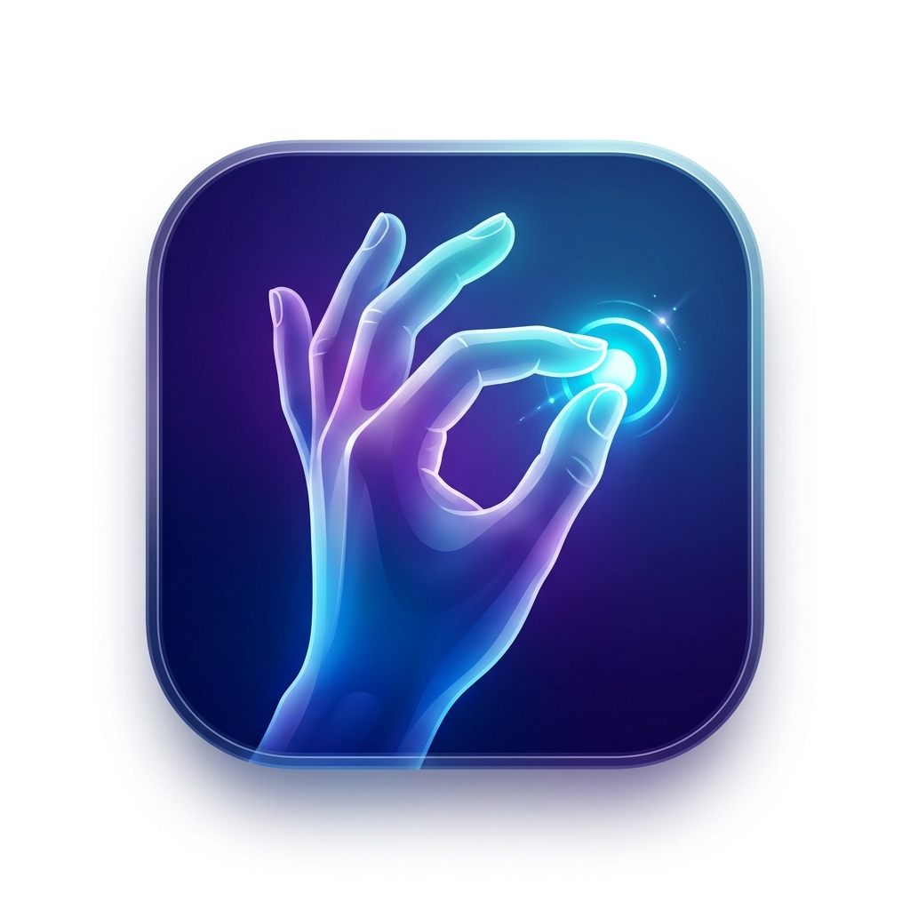

<p align="center">
  
</p>

<h1 align="center">HandCursor App 🖐️💻</h1>

<p align="center">
  <b>Controle o seu Mac usando apenas gestos das mãos, como se fosse magia.</b>
</p>

<p align="center">
  
  
  
</p>

---

O **HandCursor App** é um aplicativo que permite controlar o cursor do sistema utilizando visão computacional baseada em gestos da mão. Recentemente refatorado para **Python 3** usando **MediaPipe** da Google, o aplicativo agora entende a mão em 3D, eliminando problemas de oclusão do antigo Vision Framework da Apple.

## ✨ Funcionalidades e Gestos

A nova **Arquitetura Gatilho com Dedão** foi projetada ergonomicamente baseada na limitação dos tendões, permitindo um clique extremamente preciso onde o cursor não "pula" na hora de clicar.

- ☝️ **Navegação Livre**: Aponte o dedo indicador para cima (com o dedão recolhido). O cursor acompanha o seu dedo de forma suave, estabilizado por filtros *OneEuro*.
- 🤙 **Trava de Mira (L)**: Abra o dedão para o lado, formando um "L". O cursor irá **congelar no pixel exato** em que você está mirando.
- 🔫 **Clique / Arraste (Gatilho)**: Com o cursor travado (mão em "L"), puxe o dedão de volta para perto da mão (puxando o gatilho) para **clicar**. Mantenha o gatilho puxado e mova o pulso para **arrastar**.
- 🖱️ **Clique Direito**: Puxe o gatilho e segure por 1.2 segundos.
- 🖐️ **Scroll (Mão Espalmada)**: Abra a mão completamente (5 dedos esticados) e mova para cima ou para baixo para fazer rolagem (scroll) de forma acelerada.

## 📥 Instalação

O projeto atualmente roda direto via script Python no Terminal.

1. Clone o repositório:
```bash
git clone https://github.com/gleissondouglas/handcursor.git
cd handcursor/python_app
```

2. Instale as dependências:
```bash
pip3 install -r requirements.txt
```

3. Execute o aplicativo:
```bash
# Modo normal, em background (ideal para o dia a dia):
python3 main.py

# Modo debug, mostra uma janela com a câmera e os esqueletos da mão em tempo real:
python3 main.py --debug
```

*(Observação: Na primeira vez que rodar, o macOS ou o Terminal podem solicitar permissões de **Acessibilidade** e **Câmera**. Elas são essenciais para o aplicativo mover o mouse e enxergar a sua mão).*

## 🛠 Arquitetura (Python / MediaPipe)

O motor antigo em Swift (Vision Framework) ficava limitado a 2D e sofria oclusão quando o dedo dobrava para a câmera. O novo motor `python_app` foi desenhado com:

- `hand_tracker.py`: Wrapper do `mediapipe` para rastreamento robusto em 3D usando o modelo de 21 landmarks.
- `state_machine.py`: Máquina de estados complexa com debouncing e hysteresis que converte poses em ações do macOS.
- `filters.py`: Filtros matemáticos (`LowPassFilter` e `OneEuroFilter`) para eliminar tremulação natural da mão e estabilizar o cursor.
- `mouse_injector.py`: Injeção de eventos nativos do macOS (clique, drag, scroll) através do PyObjC e Quartz (`kCGHIDEventTap`).
- `config.py`: Arquivo centralizado com todos os *thresholds*, timings e configurações do sistema.

## 🤝 Contribuições

Sinta-se à vontade para abrir _Issues_ e _Pull Requests_. Ideias para o futuro:
- Empacotar o script Python de volta em um app nativo para macOS `.app` (ex: PyInstaller).
- Otimizações para detecção de duas mãos simultâneas.

## 📄 Licença

Distribuído sob a licença MIT.
